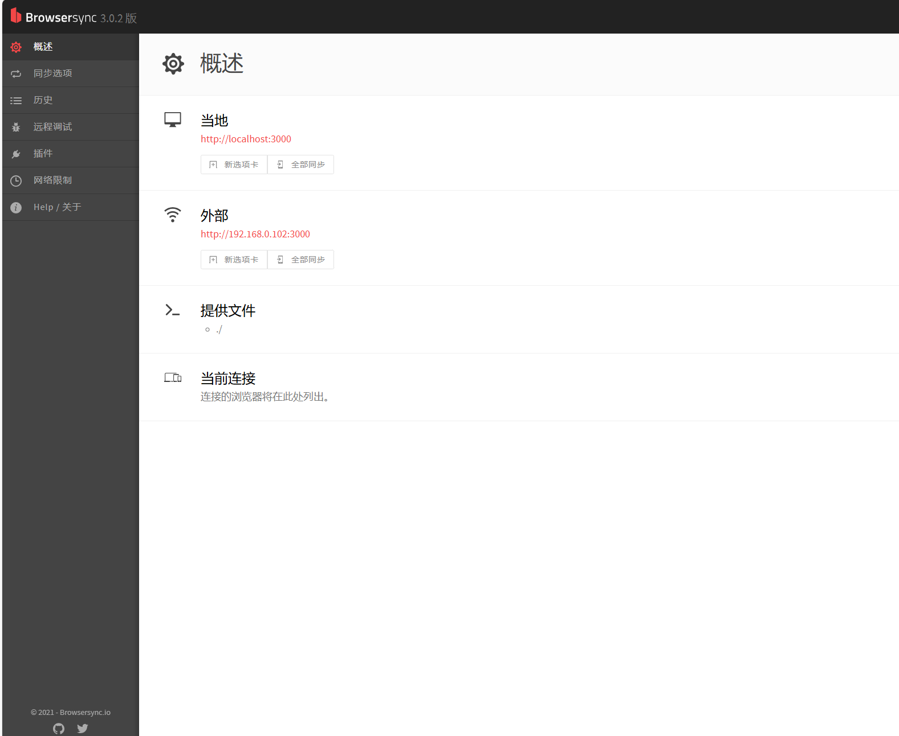

# MD转Html

> 需要用到三个库

- EJS：
>一款强大的JavaScript模板引擎，它可以帮助我们在HTML中嵌入动态内容。使用EJS，您可以轻松地将Markdown转换为美观的HTML页面。
- Marked：
>一个流行的Markdown解析器和编译器，它可以将Markdown语法转换为HTML标记。Marked是一个功能强大且易于使用的库，它为您提供了丰富的选项和扩展功能，以满足各种转换需求。
- BrowserSync：
>一个强大的开发工具，它可以帮助您实时预览和同步您的网页更改。当您对Markdown文件进行编辑并将其转换为HTML时，BrowserSync可以自动刷新您的浏览器，使您能够即时查看转换后的结果。

## 编写template.ejs

```html
<!DOCTYPE html>
<html lang="en">
<head>
    <meta charset="UTF-8">
    <meta name="viewport" content="width=device-width, initial-scale=1.0">
    <title><%= title %></title>
    <link rel="stylesheet" href="./index.css">
</head>
<body>
<%- content %>
</body>
</html>

```

## 编写Index.js调用工具转换
```js
const ejs = require('ejs')
const fs = require('fs');
const marked = require('marked');

const init = () =>{
const md = fs.readFileSync('MD转html.md','utf-8')
ejs.renderFile('template.ejs',{
content:marked.parse(md),
title: "MD TO HTML"
},(err,data)=>{
if (err) throw err
fs.writeFileSync('index.html',data)
})
}

init();

```

## MD通用样式
在 template.ejs中引入
```css
/* Markdown通用样式 */

/* 设置全局字体样式 */
body {
    font-family: Arial, sans-serif;
    font-size: 16px;
    line-height: 1.6;
    color: #333;
}

/* 设置标题样式 */
h1,
h2,
h3,
h4,
h5,
h6 {
    margin-top: 1.3em;
    margin-bottom: 0.6em;
    font-weight: bold;
}

h1 {
    font-size: 2.2em;
}

h2 {
    font-size: 1.8em;
}

h3 {
    font-size: 1.6em;
}

h4 {
    font-size: 1.4em;
}

h5 {
    font-size: 1.2em;
}

h6 {
    font-size: 1em;
}

/* 设置段落样式 */
p {
    margin-bottom: 1.3em;
}

/* 设置链接样式 */
a {
    color: #337ab7;
    text-decoration: none;
}

a:hover {
    text-decoration: underline;
}

/* 设置列表样式 */
ul,
ol {
    margin-top: 0;
    margin-bottom: 1.3em;
    padding-left: 2em;
}

/* 设置代码块样式 */
pre {
    background-color: #f7f7f7;
    padding: 1em;
    border-radius: 4px;
    overflow: auto;
}

code {
    font-family: Consolas, Monaco, Courier, monospace;
    font-size: 0.9em;
    background-color: #f7f7f7;
    padding: 0.2em 0.4em;
    border-radius: 4px;
}

/* 设置引用样式 */
blockquote {
    margin: 0;
    padding-left: 1em;
    border-left: 4px solid #ddd;
    color: #777;
}

/* 设置表格样式 */
table {
    border-collapse: collapse;
    width: 100%;
    margin-bottom: 1.3em;
}

table th,
table td {
    padding: 0.5em;
    border: 1px solid #ccc;
}

/* 添加一些额外的样式，如图片居中显示 */
img {
    display: block;
    margin: 0 auto;
    max-width: 100%;
    height: auto;
}

/* 设置代码行号样式 */
pre code .line-numbers {
    display: inline-block;
    width: 2em;
    padding-right: 1em;
    color: #999;
    text-align: right;
    user-select: none;
    pointer-events: none;
    border-right: 1px solid #ddd;
    margin-right: 0.5em;
}

/* 设置代码行样式 */
pre code .line {
    display: block;
    padding-left: 1.5em;
}

/* 设置代码高亮样式 */
pre code .line.highlighted {
    background-color: #f7f7f7;
}

/* 添加一些响应式样式，适应移动设备 */
@media only screen and (max-width: 768px) {
    body {
        font-size: 14px;
        line-height: 1.5;
    }

    h1 {
        font-size: 1.8em;
    }

    h2 {
        font-size: 1.5em;
    }

    h3 {
        font-size: 1.3em;
    }

    h4 {
        font-size: 1.1em;
    }

    h5 {
        font-size: 1em;
    }

    h6 {
        font-size: 0.9em;
    }

    table {
        font-size: 14px;
    }
}    

```


## 自启服务和热更新
利用fs模块和BrowserSync 达到自启服务和热更新的效果

```js
const ejs = require('ejs'); // 导入ejs库，用于渲染模板
const fs = require('node:fs'); // 导入fs模块，用于文件系统操作
const marked = require('marked'); // 导入marked库，用于将Markdown转换为HTML
const browserSync = require('browser-sync'); // 导入browser-sync库，用于实时预览和同步浏览器
let browser; //防止多开服务
const openBrowser =  () => {
    browser = browserSync.create()
    browser.init({
        server: {
            baseDir: './',
            index: 'index.html',
        }
    })
    return browser
}
const init= (callback)=>{
    const readme = fs.readFileSync('MD转html.md','utf-8'); // 读取README.md文件的内容
    ejs.renderFile('template.ejs', {
        content: marked.parse(readme.toString()),
        title:'markdown to html'
    },(err,data)=>{
        if(err) throw err
        fs.writeFileSync('index.html',data);
        callback && callback()
    })
}
fs.watchFile('MD转html.md',(curr,prev)=>{
    if (curr.mtime !== prev.mtime) {
        init(()=>{
            browser.reload()
        })
    }

})
```


## BrowserSync
> 支持多个网页设备同时预览，且同步动作.

