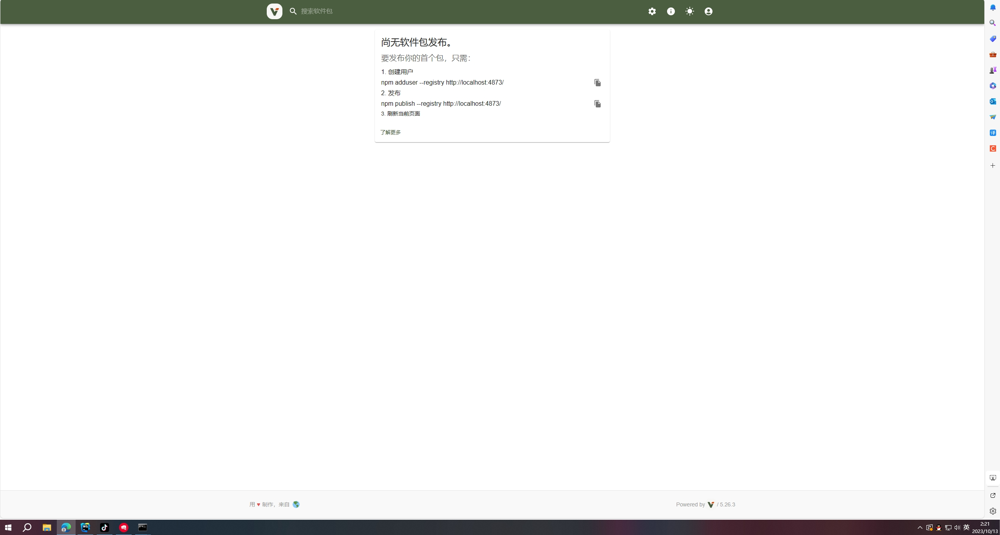

## 构建npm私服
### 什么是npm私服
npm私服是一个npm仓库，用于存放npm包，类似于maven私服

### 为什么要搭建npm私服
- 有些包在国外，下载速度很慢：可以将这些包下载到私服上，然后从私服上下载
- 离线使用：可以将私服部署在内网，然后在内网使用
- 提高包的安全性：更好的管理包，防止包被篡改，防止在使用公共包时出现漏洞
- 提高包的下载速度：将包缓存在本地，下次使用时直接从本地获取，减少下载时间。

### 搭建npm私服
- 安装verdaccio
  Verdaccio是一个轻量级的私服，可以使用它来搭建私服
```sh
npm install -g verdaccio
```
- 启动verdaccio
```sh
verdaccio
```
- 配置npm源
这一步是为了让npm使用私服，而不是使用官方源，之后就不用跟 --registry http://localhost:4873 了
这里也可以使用 xmzs 来添加并切换源
`
```sh
npm set registry http://localhost:4873
```
- 创建私服账号
```sh
npm adduser --registry http://localhost:4873
```
- 登录私服账号
```sh
npm login --registry http://localhost:4873
```

- 发布包
```sh
npm publish --registry http://localhost:4873
```
- 安装包
```sh
npm install --registry http://localhost:4873
```



