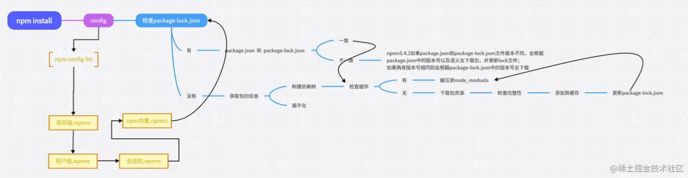

## package.json文件

### version：1.0.0
第一位: 主版本号, 当你做了不兼容的API修改（重大改动）
第二位: 次版本号, 当你做了向下兼容的功能性新增（功能的新增）
第三位: 修订号, 当你做了向下兼容的问题修正（fix Bug 修复）

### devDependencies
开发环境依赖,如: babel, webpack, eslint, jest, vite, rollup等
```sh
npm install --save-dev <package>
```
```sh
npm install -D <package>
```

### dependencies
生产环境依赖,如: react, vue, lodash, jquery等
```sh
npm install --save <package>
```
```sh
npm install -S <package>
```

### peerDependencies
peerDependencies是指插件的运行依赖(开发插件、npm包), 也就是说, 如果你的插件依赖于另一个插件, 那么你的插件就应该将这个插件列入peerDependencies, 并且指定一个版本范围, 以确保它的存在, 否则会报错
```sh
npm install --save-peer <package>
```
```sh
npm install -P <package>
```

### optionalDependencies
optionalDependencies是指插件的可选依赖, 也就是说, 如果你的插件依赖于另一个插件, 但是这个插件不是必须的, 那么你的插件就应该将这个插件列入optionalDependencies, 并且指定一个版本范围, 以确保它的存在, 否则会报错
```sh
npm install --save-optional <package>
```
```sh
npm install -O <package>
```

---

##npm命令

### 查看npm配置
```sh
npm config list 
```

### 切换源
```sh
npm config set registry https://registry.npm.taobao.org
```

### 查看全局安装的可执行文件
```sh
npm ls -g
```

## npm install

### npm install流程
1. 读取package.json文件
2. 检查本地缓存目录（prefix/cache）是否存在该模块
3. 检查本地是否存在该模块
4. 获取模块信息（prefix/registry）
5. 获取模块依赖
6. 递归执行1-5步
7. 将模块放到本地缓存目录
8. 如果是全局安装, 则将模块放到全局目录
9. 如果是本地安装, 则将模块放到node_modules目录




### .npmrc配置文件
```sh
# 设置代理
registry=http://registry.npmjs.org/
# 定义npm的registry，即npm的包下载源

proxy=http://proxy.example.com:8080/
# 定义npm的代理服务器，用于访问网络

https-proxy=http://proxy.example.com:8080/
# 定义npm的https代理服务器，用于访问网络

strict-ssl=true
# 是否在SSL证书验证错误时退出

cafile=/path/to/cafile.pem
# 定义自定义CA证书文件的路径

user-agent=npm/{npm-version} node/{node-version} {platform}
# 自定义请求头中的User-Agent

save=true
# 安装包时是否自动保存到package.json的dependencies中

save-dev=true
# 安装包时是否自动保存到package.json的devDependencies中

save-exact=true
# 安装包时是否精确保存版本号

engine-strict=true
# 是否在安装时检查依赖的node和npm版本是否符合要求

scripts-prepend-node-path=true
# 是否在运行脚本时自动将node的路径添加到PATH环境变量中
```

### package-lock.json的作用
package-lock.json是npm5新增的文件, 用于锁定依赖包的版本号, 
以便于其他开发者在npm install时生成相同的依赖关系树, 从而保证了依赖包的版本一致性

### package-lock.json缓存
integrity + version + name ===> 唯一key 存放于node_modules/.cache/_cacache/index-v5/目录下
如果这个key对应则在content-v2目录下找到对应的压缩包, 解压放到node_modules下，否则从registry中下载


## npm run

### npm run流程
1. 读取package.json文件
2. 检查scripts对象是否存在该命令
3. 执行该命令
4. 如果命令是以npm开头的, 则执行npm内部命令
5. 如果命令是以node开头的, 则执行node命令
6. 如果命令是以./或../开头的, 则执行对应的脚本文件
7. 如果命令是以其他字符串开头的, 则先在node_modules/.bin目录下查找对应的命令, 如果找到则执行, 否则在全局目录下查找对应的命令, 如果找到则执行, 否则去环境变量找，否则报错

这里全局在定义的prefix目录下，存放了全局安装的命令

### npm生命周期
1. preinstall: 在install之前执行
2. install: 安装依赖包
3. postinstall: 在install之后执行
4. preuninstall: 在uninstall之前执行
5. uninstall: 卸载依赖包
6. postuninstall: 在uninstall之后执行
7. prepack: 在npm pack之前执行
8. pack: 打包
9. postpack: 在npm pack之后执行
10. prepublish: 在npm publish之前执行
11. publish: 发布
12. postpublish: 在npm publish之后执行
13. pregit: 在git commit之前执行
14. git: git commit
15. postgit: 在git commit之后执行
16. prepush: 在git push之前执行
17. push: git push
18. postpush: 在git push之后执行
19. prestop: 在npm stop之前执行
20. stop: 停止
21. poststop: 在npm stop之后执行
22. prestart: 在npm start之前执行
23. start: 启动
24. poststart: 在npm start之后执行
25. prerestart: 在npm restart之前执行
26. restart: 重启
27. postrestart: 在npm restart之后执行
28. run predev: 在npm run dev之前执行
29. run dev: 运行
30. run postdev: 在npm run dev之后执行

## npx
### npx简介
npx是npm5.2.0版本新增的命令, 用于执行依赖包中的命令, 例如: npx webpack, npx jest等

### npx查找命令的流程
1. 查找本地是否存在该命令
2. 查找本地是否存在该命令的可执行文件
3. 查找全局是否存在该命令
4. 查找全局是否存在该命令的可执行文件
5. 查找项目依赖包中是否存在该命令
6. 查找项目依赖包中是否存在该命令的可执行文件
7. 查找远程npm仓库是否存在该命令
8. 查找远程npm仓库是否存在该命令的可执行文件
9. 报错

### npx优点
1. 不需要全局安装依赖包：npx会自动下载依赖包
2. 不需要手动更新依赖包：npx会自动更新依赖包，会在远程npm的package仓库中查找最新版本的依赖包
3. 不需要手动删除依赖包：npx会自动删除依赖包
4. 执行任意npm包中的命令：npx可以执行任意npm包中的命令，例如: npx create-react-app my-app
5. 执行Github Gist中的命令：npx可以执行Github Gist中的命令，例如: npx https://gist.github.com/zkat/4bc19503fe9e9309e2bfaa2c58074d32

### npx和npx的区别
`npx` 侧重执行命令

`npm` 侧重管理依赖,安装或者卸载模块

### npx使用场景
1. 不想在全局安装某个依赖包, 但是又想使用该依赖包中的命令，且版本号获取最新的。如：npx create-react-app my-app
2. 想使用项目依赖包中的命令，但是全局不存在，就可以使用npx直接执行。如：npx vite


